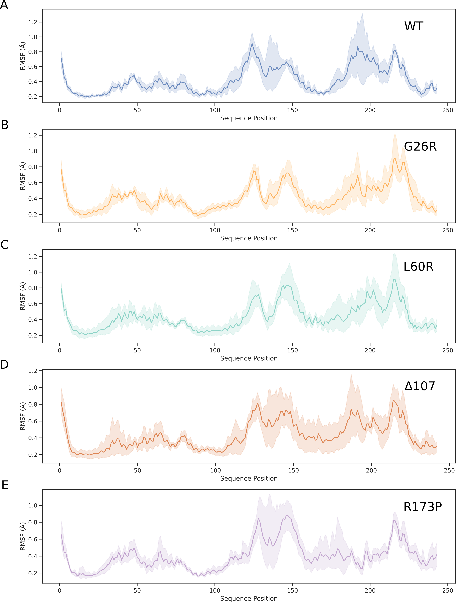

# Supplementary figure 1

{width=100%}

# Supplementary figure 2

{width=100%}

# Supplementary figure 3

{width=100%}

# Supplementary figure 4

{width=100%}

# Supplementary figure 5

{width=100%}

# Supplementary figure 6

{width=100%}
