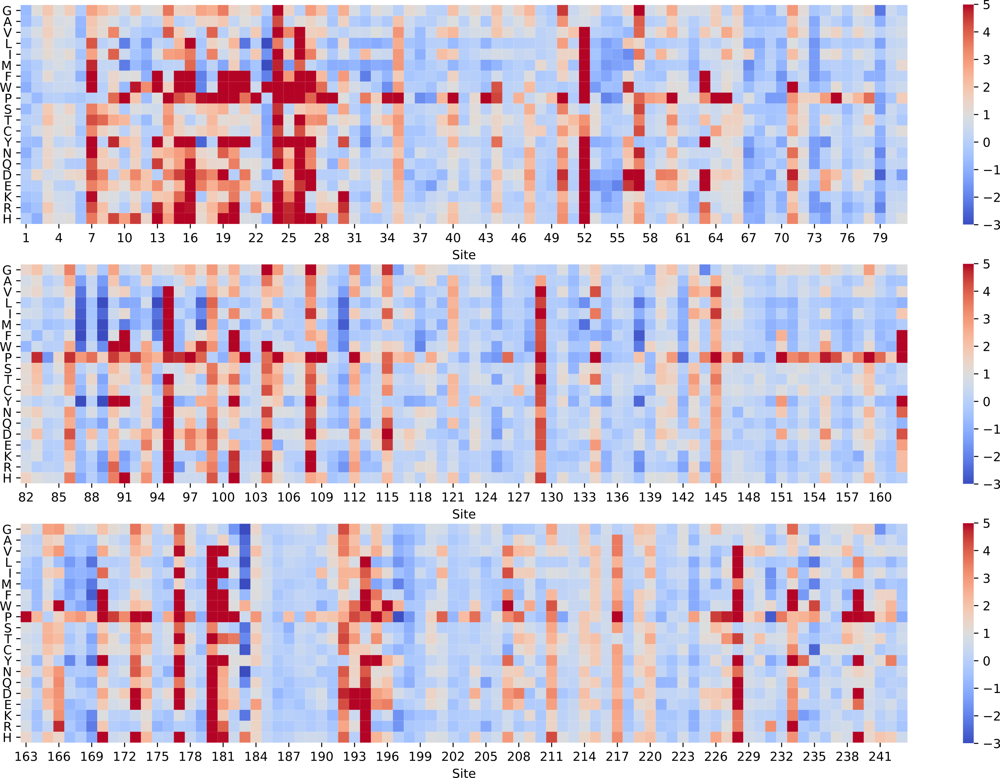
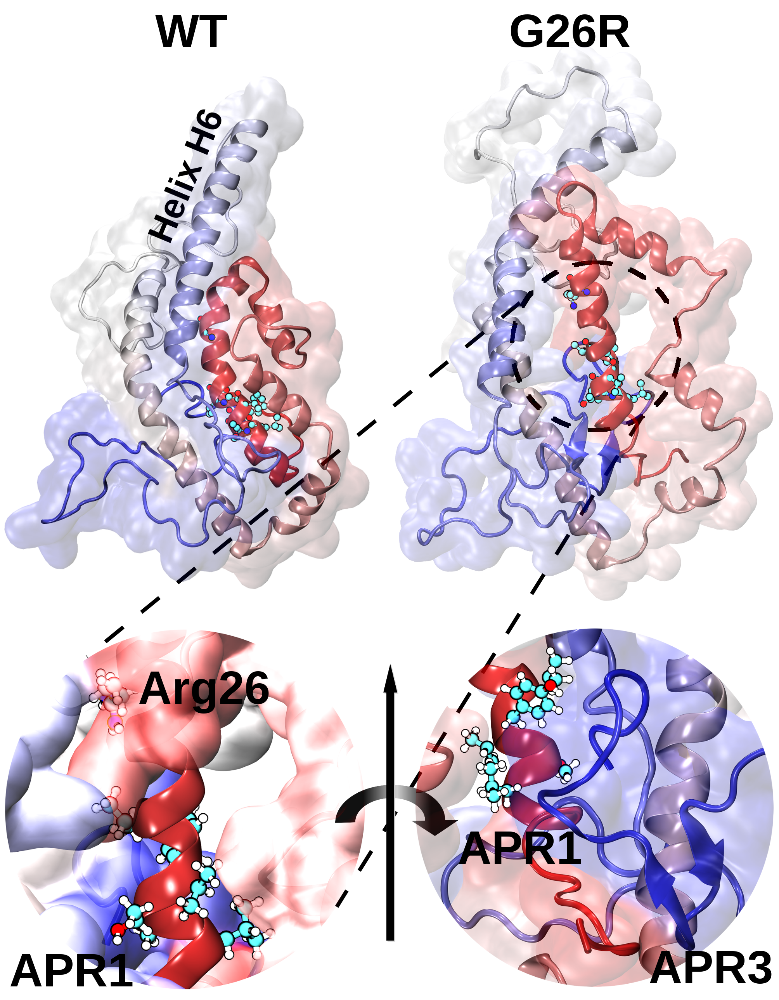

# Supplementary figure 1

{width=100%}

\newpage

# Supplementary figure 2

\newpage

# Supplementary figure 3

{width=100%}

\newpage

# Supplementary figure 4

{width=100%}

\newpage

# Supplementary figure 5

{width=100%}

\newpage

# Supplementary figure 6

{width=100%}

\newpage

# Supplementary figure 7

{width=80%}
\newpage

# Supplementary figure 8

{width=70%}
